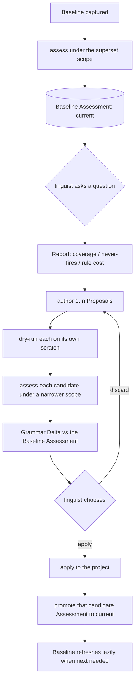
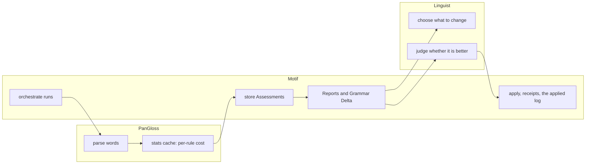
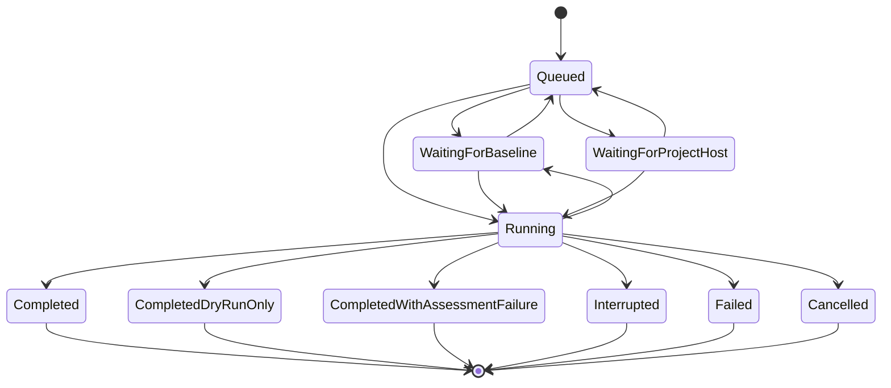
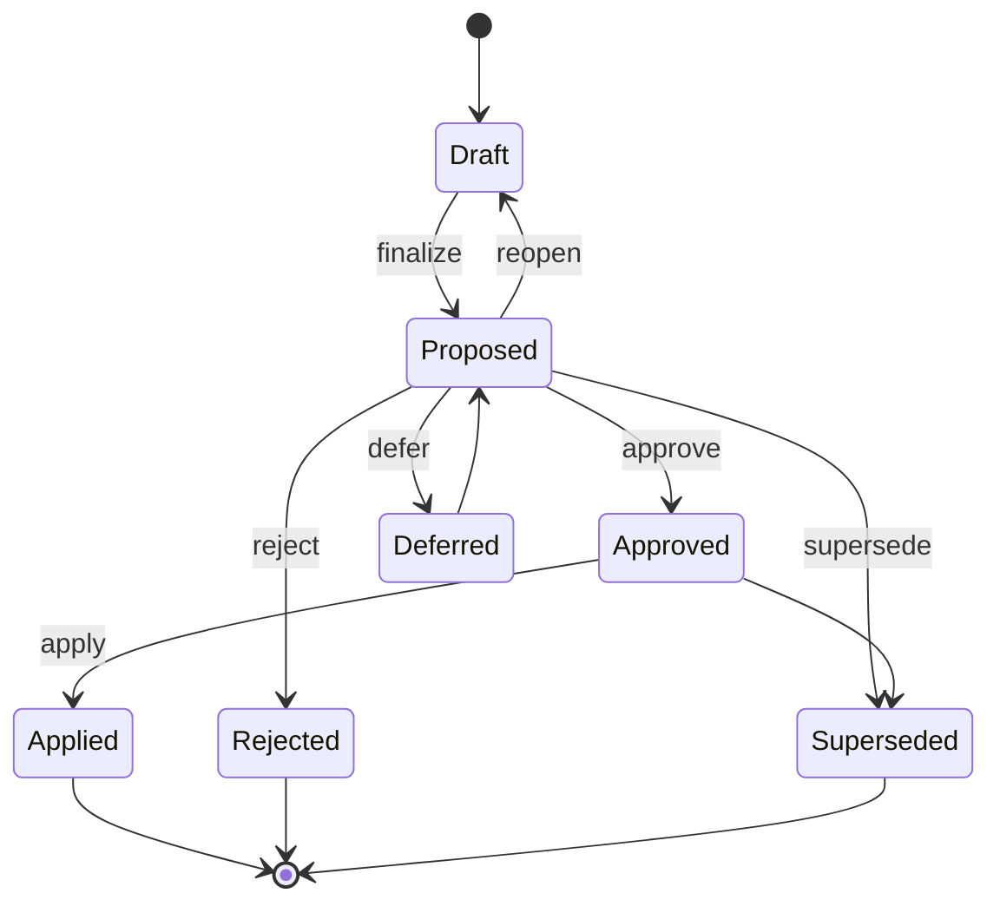

# Assessment scope — the design problem, and what is already settled

*2026-08-29. A working design document. The decisions it reached are now recorded in
[ADR 0042](adr/0042-a-job-produces-assessments-an-assessor-makes-them.md); what remains here is the working
that produced them, and the questions in §6 that are still open.*

**In plain terms:** before Motif can tell a linguist whether a grammar change helped, it has to have measured
the same thing twice. That sounds obvious and is the whole difficulty: two runs of the parser can differ in
which words they tried, which engine they used, how long they were willing to wait, and how much detail they
recorded — and two numbers produced under different conditions cannot be subtracted. This document names the
thing that must be held equal (a **scope**), records what has already been decided about measurement, and
sets out what has not.

---

## 1. What is already settled

Each of these is recorded elsewhere; this section exists so the design does not relitigate them.

### From the ADRs

| Decision | Source |
| --- | --- |
| PanGloss answers *did this word parse*; FieldWorks defines *does the parser agree with a human*; Motif owns *did our words exercise the grammar we declared*; the **linguist** answers *what would make this better* | ADR 0033 |
| Motif reimplements FieldWorks' counts keeping its field names and JSON shape, rather than inventing a parallel vocabulary | ADR 0033 decision 1 |
| Motif reports and does not answer *what would make this better* — it supplies what failed, what a human rejected, what nobody has judged, what was never exercised, and **what changed since the last run** | ADR 0033 decision 4 |
| Assessments are **stored**, because a full parse is slow; every report is a cheap query over the stored result | ADR 0035 |
| Reports are **advisory** and do not gate | ADR 0035 decision 1 — *now amended, see below* |
| A Proposal's report **pins** the Assessment it was computed against | ADR 0035 decision 3 |
| Which words a report covered is recorded on the Proposal as **non-hashed provenance**, so a reviewer may run a quick check or a full one without disturbing approvals | ADR 0035 decision 5 |
| Expectations are FieldWorks-approved analyses | ADR 0038 |
| Feeding-order reorders require a Grammar Delta | ADR 0028 |
| Agents address Layer 1 (the verb surface); Layer 0 (the hashed operation vocabulary) must not churn | ADR 0021, ADR 0029 |
| Anything only Motif reads lives in a database; anything another program must open stays a file, and the database records its path and digest | ADR 0041 decision 9 |

### Settled in this grilling session

1. **A project has a current Assessment, and applying a Proposal promotes that Proposal's candidate
   Assessment to current.** Promotion is bookkeeping only — the Baseline refreshes lazily when something next
   needs it, and a promoted Assessment carries the Baseline token it was measured against so it can never
   silently describe a project that has moved.
2. **A regression may gate, per project, and the policy is a human-readable file** — `<project>.motif.toml`
   beside the project, editable and diffable. This **amends ADR 0035 decision 1**, which said a configured
   target does not gate. The model is a failing check on a pull request: it blocks, a human may override, and
   the override is recorded. Two things make a regression: coverage dropping, and an approved analysis no
   longer being produced.
3. **Motif never holds a verdict.** PanGloss generates the data, Motif orchestrates PanGloss, stores what
   comes back, and presents it. *"This is better"* is the linguist's sentence, human or AI.
4. **The AI loop lives outside Motif.** `../linguistic-assistant` is the AI linguist ADR 0033 already
   describes. Its MDL scorer, its accept gate and its stall limit are answers to *what would make this
   better*, and belong on its side of the line. Motif's job is to be a good enough API that the loop needs
   nothing else.
5. **Per-rule and per-morpheme cost belongs to PanGloss**, which has built it: a SQLite stats cache whose
   `fact` table books `self_time_ns` at each object boundary, keyed by word, object, stratum, allomorph and
   direction. Motif stores and reports it; Motif does not derive it.
6. **Word statistics are a Report over an Assessment, not a second kind of Assessment.** One PanGloss run is
   one Assessment; coverage, never-fires and per-rule cost are all queries over it.

---

## 2. What is deferred, deliberately

- **FieldWorks integration.** Out of scope entirely for this work.
- **Which engine the fast loop runs.** Open — see the constraint in §4.
- **Who owns the stats cache files and how they are keyed.** Open.
- **Build time and FST size**, which PanGloss emits on stderr and in a separate build-evidence type rather
  than in the stats cache. Open, and a PanGloss-side dependency.
- **The Layer 1 intent catalogue.** Two Intents exist as composers; the other ~186 operations have no
  intent-level verb. Real design work, deferred until the assessment loop can tell anyone whether a change
  helped — there is no point authoring changes faster than they can be judged.
- **Retention of Assessments and stats caches.** Jobs are capped at 500 per project; nothing decides how many
  Assessments or caches a project keeps.

---

## 3. The problem: two numbers are only comparable if the same thing was measured

A PanGloss run varies along at least five axes:

| Axis | Example values | Consequence of differing |
| --- | --- | --- |
| **Which words** | all texts; one text; every word carrying a manual analysis | Coverage over different denominators is not a delta |
| **Which engine** | `foma`, `default` (HermitCrab) | Different questions answered — see §4 |
| **What is collected** | parse outcomes only; outcomes plus per-object counters | A report may be unanswerable from the run |
| **Limits** | per-word timeout, step cap | A timeout is *we stopped waiting*, not *it does not parse* |
| **Grammar** | the digest of the grammar actually parsed | The point of the comparison |

Only the last should differ between a Baseline Assessment and a candidate's. **Everything else held equal is
what a scope is.**

### The proposed shape

**Assessment Scope** — a named, declared description of what to measure: which words, which engine, what to
collect, and what limits apply. Declared per project, with a default.

Three properties it has to have:

1. **A Baseline runs the superset.** The Baseline's Assessment is measured under the union of every scope any
   Proposal will use, so a candidate measured under a narrower scope can be compared without re-running the
   Baseline. This is the owner's insight and it inverts the naive design: the expensive run happens once, on
   the widest scope, ahead of time.
2. **Comparability is a subset relation, not equality.** A candidate Assessment is comparable to a Baseline
   Assessment when its scope is contained in the Baseline's along every axis, and the comparison is computed
   over the intersection. Requiring equality would force every Proposal to pay for the full scope.
3. **Reports fall out of the scope.** A report is answerable only if the run collected what it needs — which
   is why an Assessment must record its engine and its collection settings, not just its results. Asking a
   `foma` Assessment which rules were slow must fail with *this scope did not collect per-object counters*,
   naming the reason, rather than returning zeros.

### Where the pieces live

Following ADR 0041 decision 9:

- The **scope declaration** is configuration a human edits — the `.motif.toml` beside the project.
- The **resolved scope** is embedded in the Assessment row, by content and digest, so an Assessment can never
  be reinterpreted by a later edit to the file.
- The **stats cache** is a SQLite file PanGloss owns the format of; Motif records its path and digest.
- The **Assessment** is a row in the project's paired database.

---

## 4. The constraint that shapes everything

`--engine=foma` **records word-level timing only.** Per-object counters — the ones that say which rules and
morphemes cost the time — are collected by the HermitCrab engine alone. And HermitCrab is slow: Motif's own
`PanGlossParser` records *zero of fifteen words finishing in ten minutes* on it, and `linguistic-assistant`
drives it with 45-second per-word timeouts.

The stated goal is three proposals assessed in about three minutes. **That is a foma budget.** So the fast
loop and the diagnostic cannot be the same run, and a scope has to be able to say which it is.

This is the single fact most likely to be designed around wrongly, because both runs are called "an
assessment" and produce something called "coverage".

---

## 5. The two workflows

Who owns each step:

The line between the second and third box is ADR 0033 decision 4, and it is the one most likely to erode:
every convenience that reads *"tell me which proposal is best"* moves a verdict into Motif.

---

## 6. What the next session has to decide

1. **What exactly is an axis of a scope**, and is the list closed? The five in §3 are observed, not derived.
2. **How is the superset computed?** Declared by hand in the `.motif.toml`, or derived from the scopes a
   project actually uses — and what happens when a Proposal wants a scope the Baseline never ran.
3. **Is a Report stored or recomputed?** ADR 0035 says reports are cheap queries, implying recomputation; a
   Check Run freezes its inputs, implying storage. Both may be true, and the rule needs stating.
4. **What happens when the `.motif.toml` changes** and existing Assessments reference a scope that no longer
   exists as declared.
5. **How a scope names its words.** A **Selection** ("all words carrying a manual analysis" is the proposed
   default) is a `CONTEXT.md` term already; is a scope's word set always a Selection?
6. **Report tailoring.** *"Skim it down to one word, or one text"* — is that a filter argument on a report, or
   a narrower scope? They are different: one re-queries stored data, the other implies a new run.
7. **Retention.** How many Assessments and stats caches a project keeps.

---

## 7. Amendments — 2026-08-29

### The engine constraint in §4 was overstated

§4 says per-object counters are collected by HermitCrab alone, and builds a conclusion on it: that the fast
loop and the per-rule diagnostic can never be the same run. **That is a description of what PanGloss ships
today, not a property of the problem.** Any backend can support per-object counters, HermitCrab included, and
counters from other grammars are useful in their own right.

So the honest statement is narrower: *today*, `--engine=foma` records word-level timing only, so today a
scope must choose. If foma gains counters the choice disappears, and nothing in the design should assume it
will not. §4's framing — treat the trade-off as permanent — would have hardened a temporary gap into an
architecture.

### Word limits have a default

A scope carries a per-word limit, defaulting to about **one second, or an equivalent cap on attempts**.
PanGloss already distinguishes the two mechanisms and their outcomes: `--word-timeout-ms` sets a wall-clock
bound and marks a word `timed_out`; `--step-cap` bounds work and marks it `capped`. Both are distinct from a
word that genuinely did not parse, and all three flags are stored per word.

The limit is part of the scope rather than a run-time flag, because a coverage figure computed under a
one-second cap is not comparable with one computed under ten.

### An Assessment is not a PanGloss run — it is one measurement by one assessor

The reframing that motivates this amendment: a **Job** is the queued unit of work, and a job may produce
**several Assessments**, each made by an **Assessor**. PanGloss is one assessor. A C# HermitCrab is another.
An SMT alignment model asking whether more lexemes align is a third, and it is not a parser at all.

This is a better model than "one PanGloss run is one Assessment", for three reasons:

1. It matches what the code already anticipates. `JobStatus.CompletedWithAssessmentFailure` exists, which
   only makes sense if a job and an assessment are different things that can fail separately.
2. It makes new measures additive. Adding an alignment measure becomes a new assessor rather than a new
   concept, and every scope, report and comparison mechanism already built continues to apply.
3. It puts the comparability rule in one place. Two Assessments are comparable when they share an assessor
   **and** their scopes are compatible — and the assessor check is what stops anyone subtracting an alignment
   score from a parse coverage figure.

**The cost, stated plainly.** `CONTEXT.md` currently says of Assessment: *"PanGloss owns this word."*
`../linguistic-assistant` agrees: *"'Assessment' belongs to PanGloss, not this evaluation."* Making it Motif's
general term takes the word back, and both statements become wrong. The alternative is a different general
term — *Measurement* — leaving Assessment to PanGloss.

Recommended: **Motif takes the general term.** Motif is the system that has several of them, which is what
earns the general noun; a PanGloss assessment becomes one kind. But this must be written into all three
glossaries at once, because a term that means one thing here and another next door is worse than either
choice.

### The three state machines, written down

**Job** — ten states, and the only one of the three with a transition table in code
(`JobStateMachine.Transitions`):

**Proposal** — seven states, enforced by the repository rather than by a table:

**Assessment** — **no lifecycle at all, deliberately.** An Assessment is immutable once written, like a
`ProposalRevision`. What has states is the Job that produced it. "Current" is not a state on an Assessment
but a **pointer held by the project**, which promotion moves — the same shape as `Proposals.CurrentIntentDigest`
pointing at a revision. Inventing a third state machine here would give two places the power to say an
Assessment is stale, and they would disagree.
