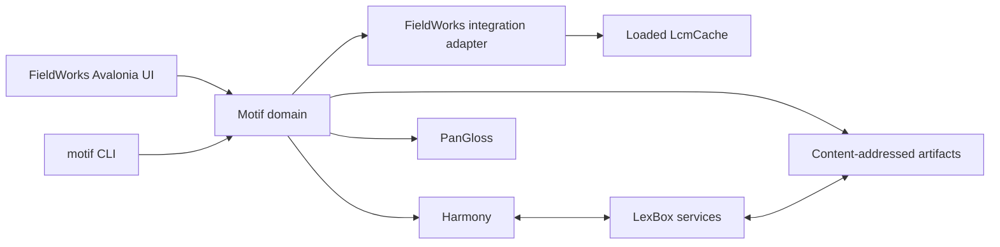

# Motif


> **Substrate superseded 2026-08-01 — the product thinking stands.** This document predates
> [Plan A](plan-motif.md), adopted from [harmony-adoption-report.md](harmony-adoption-report.md).
> Its workflow, evidence corpus, review model, UI/CLI split, and risk analysis are unchanged and still
> the product intent. **What is overturned is the substrate**, everywhere it appears below:
>
> | This document says | Plan A |
> | --- | --- |
> | Harmony/LcmCrdt provide the collaborative state | The live LibLCM model is the only authority on Motif's path |
> | "Use Harmony for collaborative history and synchronization" (goal 5) | Proposals and Receipts are immutable documents in a Lexbox object store; no CRDT |
> | "Harmony synchronizes the proposal, reviews, decision, and receipt" | Lexbox does, optionally per project (`MOT-14`) |
> | ADR 0013 remains binding | ADR 0013 is scoped to FwLite; grammar does not route through the CRDT |
> | Application-specific Harmony entities and changes | Generated LibLCM operations (`MOT-4`) |
>
> Harmony remains the right substrate for FwLite and is untouched. Read "Harmony" below as "the
> collaborative store", and see Plan A for what that is now.

## A PR-like semantic collaboration system for language projects

Motif lets humans and AI agents propose, check, review, approve, apply, and audit semantic changes
to lexical, text, and grammar data. Grammar is the first customer. Harmony/LcmCrdt provide the
convergent collaborative state—the target modern successor to monolithic `.fwdata`—while Motif
adds the GitHub-like workflow layer and LibLCM remains the FieldWorks invariant, lifecycle, and
compatibility boundary.

The exact authority and state-machine rules are normative in

Status: proposal for discussion. **Naming settled** by
[grill-decisions D7](grill-decisions.md#d7--the-name-is-motif-and-it-absorbs-lcatom) and executed —
the earlier *Grammar Workbench* / `gbench` naming in this document was rejected and has been replaced
throughout.

Date: 2026-07-28. Renamed to Motif 2026-07-30.

Repository: **`motif`**

Command-line application: **`motif`**

Companion plans, kept aligned with this one — see
[plan-cross-repo.md](plan-cross-repo.md) for the shared milestone table:

- [plan-motif.md](plan-motif.md) — this repository (manifest, generator, semantic + lowering layers)
- [plan-lcmcrdt.md](plan-lcmcrdt.md) — `languageforge-lexbox` (`backend/FwLite/LcmCrdt`)

## Executive summary

FieldWorks already contains the language project's texts, lexicon, grammar, manually selected word
analyses, parser integration, and the emerging native Avalonia user interface. PanGloss can import a
FieldWorks project, run its HermitCrab-compatible parser, compare grammar revisions, and explain
changed analyses. Harmony already supplies offline-first changes, commit history, snapshots, and
synchronization.

What is missing is the application that joins those capabilities into a disciplined improvement
loop:

> propose a grammar or analysis change, run it against curated words from real FieldWorks texts,
> inspect exactly what changed, ask a human or AI reviewer, accept or reject the proposal, and retain
> the evidence and history.

Motif is that application.

It has two first-class interfaces:

- native Avalonia components inside FieldWorks for linguists and native-speaker review;
- an independently runnable .NET 10 CLI, `motif`, for automation and AI-assisted or autonomous
  investigation.

Motif does not replace FieldWorks, LibLCM, Harmony, LexBox, or PanGloss. It defines the
grammar-assessment, evidence, proposal, and review domain between them.

## The problem

Changing a grammar rule can improve one word and break fifty others. Looking only at whether a test
word parses encourages overfitting. Looking only at aggregate parse counts hides which analyses were
added, lost, or made ambiguous. Treating every new analysis as an improvement is wrong; treating
every removed analysis as a regression is also wrong.

The project needs more than a parser and more than a list of words. It needs:

- real words in real FieldWorks texts;
- manually selected analyses;
- explicit required, forbidden, allowed, and unresolved expectations;
- stable history when texts, analyses, grammar, or expectations change;
- baseline and candidate parser runs with exact provenance;
- structural comparison of analyses;
- native-speaker and linguistic review;
- an AI path that can perform the same evidence-driven work without pretending to be human;
- safe application through FieldWorks' existing unit-of-work, undo, save, and synchronization
  behavior.

Existing tools contain pieces of this flow, but no component owns the whole application-level
workflow.

## Product thesis

Grammar development should look like software development:

| Software development | Motif |
|---|---|
| Source | FieldWorks lexicon and grammar |
| Test cases | Curated occurrences and word-level expectations |
| Build | PanGloss imports and compiles the grammar |
| Test run | PanGloss assesses the curated suite |
| Diff | Baseline/candidate structural analysis comparison |
| Code review | Human or AI review of the proposal and evidence |
| Commit history | Harmony commits and synchronized review state |
| Apply | One approved FieldWorks unit of work |
| Regression suite | Versioned permanent word-evidence corpus |

The analogy is useful only if the evidence remains linguistically honest. A native speaker may judge
whether a form or interpretation is acceptable. A linguist may judge formal analysis structure. An
AI may propose or classify based on available evidence. PanGloss reports deterministic parser facts.
These roles must remain distinguishable.

## Goals

1. Make grammar changes reviewable against a permanent, versioned body of word evidence.
2. Ground evidence in FieldWorks texts and manually selected analyses.
3. Show exactly which structured analyses were added, removed, retained, or became incomplete.
4. Support both human/Avalonia and AI/CLI reviewers through the same application contracts.
5. Use Harmony for collaborative history and synchronization rather than inventing another change
   mechanism.
6. Apply accepted language-project mutations through FieldWorks and LibLCM safely.
7. Preserve enough provenance to reproduce every material assessment and decision.
8. Allow useful work during FieldWorks' net48-to-net10 transition.

## Non-goals

Motif will not:

- reimplement FieldWorks;
- replace LibLCM as the language-project model or persistence layer;
- replace PanGloss or implement another morphological parser;
- create a competing CRDT or change-set mechanism beside Harmony;
- make raw LibLCM property scripts canonical input;
- let an AI silently modify a live FieldWorks project;
- equate an AI judgment with native-speaker confirmation;
- use parser output as gold merely because the parser produced it;
- automatically declare a grammar “better” from one scalar score;
- make browser/React components the FieldWorks product UI;
- put large traces, model transcripts, or parser-run blobs directly into Harmony commits.

## Core domain

*The canonical glossary is [CONTEXT.md](../CONTEXT.md); the terms below are this document's own
subdomain and must not contradict it.*

### Language-project facts

FieldWorks and LibLCM remain authoritative for:

- texts, paragraphs, segments, and word occurrences;
- wordforms and reusable analyses;
- the analysis selected for a particular occurrence;
- human and parser-agent opinions;
- lexical and grammatical data;
- project lifecycle, persistence, undo, and save.

### Evidence corpus

Motif owns the collaborative evidence and review model:

- **Evidence case** — a stable case ID, input form, occurrence anchor, context, and tags.
- **Occurrence anchor** — a reference to the FieldWorks text location plus enough evidence to detect
  that the location moved, became ambiguous, or disappeared.
- **Expectation policy** — required, forbidden, allowed, open-world, closed-world, unresolved, or
  out-of-scope analysis expectations.
- **Gold revision** — an immutable reviewed revision of a case's expectation policy.
- **Assessment** — an immutable PanGloss run against one grammar and one suite revision.
- **Grammar delta** — exact structural differences between baseline and candidate assessments.
- **Dry Run** — what a Proposal would do to a live LibLCM model, computed without mutating it.
  *Distinct from Assessment*, deliberately: an Assessment asks whether the grammar parses better, a
  Dry Run asks what applying the change would do to the project. See
  [ADR 0015](adr/0015-proposal-assessment-dry-run-vocabulary.md).
- **Proposal** — a bounded candidate grammar, lexical, occurrence-analysis, or evidence-policy
  change. The stored, reviewable unit; it owns its attached Assessments and has a lifecycle.
- **Review** — a human, AI, import, or system judgment over a pinned proposal and evidence set.
- **Decision** — approved, rejected, needs revision, needs native-speaker review, or superseded.

### Three analysis scopes

The system must never collapse:

1. the analysis selected for this occurrence in a FieldWorks text;
2. a human or parser agent's opinion of a reusable `WfiAnalysis`;
3. the evidence corpus's expectation about parser behavior.

They can disagree legitimately. For example, the manual occurrence analysis may be correct while the
current grammar fails to produce it.

## System architecture



The diagram shows logical dependencies, not one process. During the FieldWorks net48 transition:

- FieldWorks hosts native Avalonia review components and a thin integration adapter;
- Motif domain services, Harmony integration, PanGloss orchestration, and `motif` target
  .NET 10;
- FieldWorks communicates through a narrow netstandard2.0-compatible contract or versioned local
  protocol;
- PanGloss runs through its native CLI, SDK, or C ABI;
- after FieldWorks moves to .NET 10, selected components may move in process without changing the
  semantic contracts.

## Component ownership

| Component | Owning repository | Reason |
|---|---|---|
| Texts, occurrences, analyses, grammar and lexicon | LibLCM / FieldWorks | Existing language-project authority and invariants |
| Live project mutation, UOW, undo, save, refresh | FieldWorks | Requires the loaded cache and application lifecycle |
| Native human review UI | FieldWorks Avalonia modules | This is the permanent FieldWorks UI direction |
| Grammar import, compilation and parsing | PanGloss | Existing deterministic engine |
| Structured analysis identity | PanGloss | Must match parser semantics |
| Assessment, grammar-delta and trace artifacts | PanGloss | Engine-owned deterministic evidence |
| Generic commits, snapshots and CRDT synchronization | Harmony | Existing reusable change mechanism |
| Authentication, remote transport and hosted synchronization | LexBox | Existing collaboration infrastructure |
| Cases, gold revisions, proposals and review workflow | Motif | New bounded application context |
| Application-specific Harmony entities and changes | Motif | Product semantics using Harmony mechanics |
| PanGloss orchestration and artifact correlation | Motif | Joins parser facts to cases and proposals |
| AI provider integration and job policy | Motif | Application policy, secrets, budgets and audit |
| Independent automation CLI | Motif (`motif`) | First-class noninteractive product interface |
| Coverage research and migration evidence | This repository as it transitions | The pre-rename research assets remain useful |

## Why this repository became Motif

Creating a new repository was initially attractive because the application has a lifecycle distinct
from FieldWorks, PanGloss, Harmony, and LexBox. This repository became that repository instead: it was
renamed `motif` on 2026-07-30, and the *LCAtom* name is retired everywhere except in historical
records of the decision itself.

It already contained:

- the LibLCM coverage inventory;
- the HCLoader-derived grammar map;
- detailed grammar-ordering and identity research;
- the FieldWorks/PanGloss/Harmony integration analysis;
- the word-evidence corpus model;
- the repository-ownership decision;
- the PanGloss implementation handoff;
- a working but now strategically superseded experimental CLI and runner.

Reusing the repository preserves the reasoning and avoids creating an empty architecture repository.
However, the transition must stay explicit — a rename is not an architecture:

- **Motif is not the old runner renamed while retaining its original architecture.** The `SIL.Motif.*`
  projects carry the new name over the pre-ADR-0013 design; they are not thereby endorsed.
- ADR 0013 remains binding: Harmony is the change mechanism.
- The retired operation envelope, digest, snapshot, runner, and applied-log model do not become a
  parallel production path.
- Useful tests or LibLCM proof code may be harvested, but no obsolete contract is preserved merely
  because it already exists.
- Historical documents remain clearly marked as superseded or are moved under a history area.

Package names remain open: **the NuGet and npm `Motif`/`motif` namespaces have not been checked**, and
must be before anything is published.

## The `motif` CLI

`motif` is a separately installable .NET 10 command-line application. It is the automation and AI
surface for the same workflows exposed through FieldWorks Avalonia.

Illustrative commands:

```text
motif project init
motif cases list
motif cases show <case>
motif assess run --baseline <revision> --candidate <revision> --suite <suite>
motif assess compare <baseline-assessment> <candidate-assessment>
motif review show <proposal>
motif review propose <proposal> --decision <...>
motif review abstain <proposal> --reason <...>
motif ask-ai <proposal> --provider <provider> --model <model>
motif jobs list
motif jobs resume <job>
motif artifacts verify <artifact>
motif submit <proposal>
```

### CLI principles

- Commands express application verbs, not raw property mutation.
- Every AI request pins model, provider, prompt version, evidence digests, budgets, and redaction.
- AI output becomes a typed proposal, abstention, or request for human review.
- An AI reviewer is recorded as `AI`, never as a human or native speaker.
- Deterministic validation runs before an AI proposal can advance.
- The first release does not directly apply to a live `.fwdata` project.
- Later `motif apply` may request FieldWorks to apply an already approved command; FieldWorks remains
  the apply authority.
- Offline operation uses a local Harmony store and content-addressed artifact directory.
- Remote operation synchronizes through the Motif/LexBox service boundary.

## FieldWorks Avalonia experience

The new UI is built now on FieldWorks' active Avalonia migration architecture, even while the
application remains net48.

Initial components:

1. **Proposal queue** — pending grammar, lexical, analysis, and gold-policy proposals.
2. **Changed-word browser** — baseline/candidate outcomes, tags, filters, and evidence completeness.
3. **Occurrence context** — source text, selected analysis, parser analyses, and anchor status.
4. **Structured analysis comparison** — added, removed, retained, required, forbidden, and allowed.
5. **Decision panel** — approve, reject, revise, abstain, or request native-speaker review.
6. **History view** — proposal, evidence, reviews, supersession, and application receipt.
7. **Trace/diagnostic view** — on-demand PanGloss investigation handoff and factual breadcrumbs.

These components follow the established FieldWorks migration rules:

- LCModel-free view models;
- typed view-definition and region seams;
- explicit host selection and no silent fallback;
- projectors and write-back in FieldWorks/xWorks integration code;
- FieldWorks edit sessions, UOW/undo-redo, scheduler, lifetime and command routing;
- localization, accessibility, automation and parity evidence.

## PanGloss contract

PanGloss is implementing the deterministic evidence layer described in
`pangloss-grammar-assessment-handoff-spec.md`.

Required outputs include:

- immutable assessment reports;
- exact grammar deltas;
- golden-set diffs;
- complete/incomplete/not-attempted distinctions;
- required/forbidden/allowed expectation evaluation;
- import and compiler diagnostics;
- provenance and model fingerprints;
- on-demand traces and FieldWorks investigation handoffs.

PanGloss never emits a “better” verdict. Motif presents the facts and records the
reviewer's decision.

## Harmony model

Harmony supplies commits, history, snapshots, unknown-change preservation, and synchronization.
Motif supplies the application objects and changes.

Candidate synchronized objects:

- evidence suite;
- evidence case;
- occurrence anchor and resolution status;
- gold revision;
- proposal;
- review;
- decision;
- artifact reference;
- FieldWorks application receipt;
- reviewer and policy metadata.

Raw traces, parser transcripts, AI prompts/responses, and large reports live in content-addressed
artifact storage. Harmony objects carry immutable hashes and metadata references.

Ordered grammar cannot use a generic last-writer-wins order field. Motif must define
aggregate operations and concurrency rules that preserve rule order, positional references, and
linguistic invariants. A genuinely reusable CRDT primitive may be contributed upstream to Harmony;
grammar-specific semantics remain in Motif.

## Safe FieldWorks application

The first live write path is deliberately narrow:

```text
approved Motif command
  → FieldWorks validates target and baseline
  → one outer LibLCM undoable unit of work
  → deterministic read-back
  → normal FieldWorks save
  → UI/parser invalidation
  → application receipt returned to Motif
```

Harmony persistence and LibLCM save are separate durability boundaries. The system does not claim a
distributed transaction or exactly-once execution. It uses:

- durable command IDs;
- inbox/outbox state;
- idempotent replay;
- read-back hashes;
- explicit `queued`, `applied-in-cache`, `saved`, `recorded`, and `needs-reconciliation` states;
- crash tests at every transition.

## Relationship with Chorus and LexBox

The existing LexBox headless synchronizer already demonstrates snapshot-mediated bidirectional
Harmony/`.fwdata` synchronization for a bounded lexical surface. Motif should reuse its
lessons:

- synchronize Chorus/Send-Receive before CRDT projection when needed;
- compare both current states with a last-successful snapshot;
- save and transport projected changes before advancing the snapshot;
- block after detected rollback;
- synchronize Harmony again after learning FieldWorks changes.

The initial live FieldWorks integration should avoid a second process independently writing the open
project. Longer term, shared-backend or headless modes may be supported only after explicit
conformance.

LexBox is the likely host for authenticated remote synchronization, artifact transport, and scheduled
services. It does not need to absorb Motif's domain into the lexical MiniLcm API.

## End-to-end workflows

### Human-reviewed grammar proposal

1. A linguist authors or receives a bounded grammar proposal.
2. Motif materializes baseline and candidate inputs without touching the live project.
3. PanGloss assesses both against the pinned suite.
4. Motif records reports and exact deltas.
5. FieldWorks Avalonia displays changed cases in textual and analytical context.
6. The reviewer approves, rejects, requests revision, or asks a native speaker.
7. FieldWorks applies an approved command as one UOW and returns a receipt.
8. Harmony synchronizes the proposal, reviews, decision, and receipt.

### AI-assisted review

1. `motif` selects cases with complete, pinned evidence.
2. It runs or retrieves PanGloss assessment artifacts.
3. It sends a redacted, versioned evidence bundle to a configured AI provider.
4. It validates the response against the allowed proposal schema.
5. It records an AI proposal, abstention, or request for speaker review.
6. A human may review it in FieldWorks, or an objective predeclared policy may advance it.
7. The ordinary FieldWorks apply path remains unchanged.

### Correcting the evidence corpus

1. A reviewer discovers that the manual analysis or expectation is wrong.
2. They create a separate occurrence-analysis or gold-revision proposal.
3. Motif does not silently rewrite gold while reviewing a grammar proposal.
4. The correction is reviewed, accepted, and versioned.
5. Assessments against the new suite revision remain distinguishable from earlier runs.

## Delivery plan

### Phase 0 — Repository transition — **status: partial, 2026-07-30**

- ~~adopt Motif terminology~~ — **done** (grill-decisions D7);
- ~~rename the CLI entry point to `motif`~~ — **done** (`AssemblyName` is `motif`, store is `./.motif`);
- ~~retain the pre-rename research and coverage evidence~~ — **done**, nothing was deleted;
- quarantine the superseded runtime architecture — **not done**: the `SIL.Motif.*` runner still builds
  and its 82 tests still pass, and nothing marks it quarantined in code;
- establish CI and ownership — **not done**: there are still no `.github/workflows` in this repo;
- write the context glossary and repository-level ADR for the transition — **not done**; the naming
  half is recorded in grill-decisions D7, the architecture half in ADRs 0013 and 0014;
- check the NuGet and npm namespaces — **not done**, and it gates publishing.

### Phase 1 — Evidence-only walking skeleton

- define one evidence case and suite revision;
- resolve one occurrence through a read-only FieldWorks adapter;
- run baseline/candidate PanGloss assessments;
- persist artifact references;
- display the result through `motif`;
- no Harmony collaboration and no project mutation yet.

### Phase 2 — Review domain

- implement proposal, review, decision and supersession state;
- add application-specific Harmony objects and changes;
- support local offline synchronization;
- add deterministic provenance and artifact verification;
- allow `motif` to submit human or AI reviews.

### Phase 3 — FieldWorks Avalonia

- add proposal queue and changed-word browser;
- navigate to real occurrences and analyses;
- render structured deltas and evidence completeness;
- record human/native-speaker decisions;
- retain explicit fallback and parity evidence during WinForms coexistence.

### Phase 4 — Safe live apply

- apply one approved lexical scalar command;
- add one occurrence-analysis command;
- prove undo, redo, save, reload and crash reconciliation;
- add parser/UI invalidation;
- emit durable application receipts.

### Phase 5 — Grammar collaboration

- add one bounded grammar operation family;
- implement grammar-specific ordering and conflict rules;
- run the permanent evidence corpus before approval;
- prove concurrent/offline behavior;
- expand only through conformance gates.

### Phase 6 — Hosted collaboration

- integrate LexBox authentication and remote sync;
- transport content-addressed artifacts;
- add scheduled assessment jobs;
- support team review and remote AI workers;
- prove Chorus coexistence and migration behavior.

## First vertical slice

The first deliverable should answer one complete question:

> Can one FieldWorks occurrence, one expected analysis, and one bounded candidate change flow through
> PanGloss evidence, `motif` review, and FieldWorks preview without mutating the live project?

Required proof:

1. A real FieldWorks text occurrence and manually selected analysis.
2. A portable occurrence anchor with explicit resolution status.
3. A baseline and candidate grammar source.
4. Two PanGloss assessment reports.
5. One exact structural delta and golden-set diff.
6. One `motif review` proposal or abstention with provenance.
7. One FieldWorks Avalonia preview using a fake or local Motif projection.
8. No direct `.fwdata` write.

This slice proves the product boundary before committing to broad grammar CRDT coverage.

## Success measures

The project succeeds when:

- every accepted grammar change has reproducible baseline/candidate evidence;
- incomplete or unsupported parser outcomes are never reported as empty success;
- reviewers can move from a changed word to its FieldWorks occurrence and analysis;
- gold corrections retain history instead of rewriting prior evidence;
- humans and AI use the same proposal and evidence contracts;
- AI provenance is explicit and never represented as speaker confirmation;
- accepted live changes are one undoable FieldWorks operation with verified read-back;
- offline changes synchronize without silent loss or causal loops;
- adding a new grammar operation requires a closed schema, validation, projection, conflict behavior,
  PanGloss effects, and conformance fixtures.

## Principal risks

| Risk | Response |
|---|---|
| Occurrence anchors drift after text edits | Explicit resolved/orphaned/ambiguous status; never silently reattach |
| Grammar order merges into a linguistically different grammar | Aggregate operations and grammar-specific conflict rules |
| Importer loss looks like parser improvement | Retain and compare all importer/compiler diagnostics |
| AI overstates uncertain evidence | Typed abstention and needs-speaker-review; deterministic evidence remains authoritative |
| Two writers corrupt an open project | FieldWorks owns live mutation; headless/shared modes require proof |
| Harmony and Chorus create loops | Snapshot baseline, origin metadata, rollback blocking and lifecycle gates |
| Large reports overload CRDT state | Content-addressed artifacts; synchronize only hashes and metadata |
| The rename to Motif is mistaken for endorsement of the retired runner | ADR 0013 remains binding; the obsolete runner is quarantined, not promoted — and Phase 0 records that this quarantine has not actually been done yet |
| Scope expands into reimplementing FieldWorks | UI and live linguistic data stay in FieldWorks; Motif owns workflow only |

## Decisions requested

This proposal asks stakeholders to agree that:

1. ~~this repository becomes **motif**~~ — **settled and done**, D7;
2. ~~the CLI is named **`motif`**~~ and ~~targets .NET 10~~ — **both settled and done**; the shipped
   CLI is `net10.0`, and `net8.0` is no longer a target anywhere (AGENTS.md, Compatibility targets);
3. FieldWorks Avalonia is the primary human interface;
4. PanGloss is the deterministic assessment engine;
5. Harmony is the change/history/synchronization mechanism;
6. FieldWorks and LibLCM remain authoritative for live linguistic project data;
7. Motif owns cases, gold revisions, proposals, reviews, orchestration, and artifact
   correlation;
8. LexBox hosts collaboration infrastructure without absorbing the domain into lexical MiniLcm;
9. the first vertical slice is evidence-only and does not mutate the live project;
10. full grammar CRDT authority is earned incrementally through conformance, not assumed at project
    start.

## Immediate next actions

1. Review this pitch with FieldWorks, PanGloss, Harmony, and LexBox maintainers.
2. ~~Confirm repository naming~~ — done; **package naming (NuGet, npm) is still unconfirmed.**
3. Accept PanGloss's assessment-report contract or feed corrections back to its implementation.
4. Define the first evidence-case and occurrence-anchor schemas.
5. Establish the Motif solution skeleton and CI.
6. Implement the evidence-only `motif` vertical slice.
7. Build the matching FieldWorks Avalonia preview component against fake projection data.
8. Reassess repository boundaries after the slice before adding live apply or broad CRDT coverage.

The generation work that ADR 0014 settled runs in parallel with steps 3–6 and spans three
repositories. Its sequencing, and the dependencies between the three, are in
[plan-cross-repo.md](plan-cross-repo.md).
