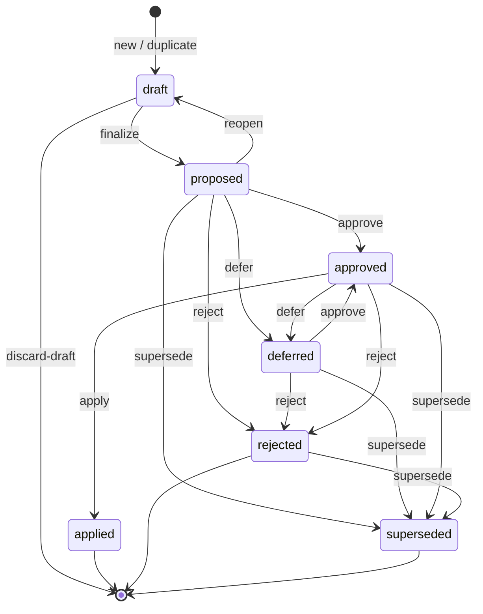

# The Proposal lifecycle

*2026-08-29. What every state means, what moves between them, and where Jobs and Assessments attach. The
states and guards below are read from the code, not aspirational — `ManifestStatus`,
`Commands.DeferrableFrom`/`ApprovableFrom`/`RejectableFrom`/`SupersedableFrom`, and
`ProposalRepository`.*

**In plain terms:** a proposed change to a linguist's grammar goes through a handful of named stages —
being written, submitted, judged, and finally written into the project. This says exactly what each stage
means and what may follow it, so that "committed" and "approved" and "applied" cannot drift into meaning
whatever the reader assumed. It also says where the measuring fits: a measurement is attached to a proposal,
but it is never one of the proposal's stages.

## The seven states

| State | What is true of it |
| --- | --- |
| **draft** | Being authored. Carries a draft name and its in-progress content. Has **no committed revision** if it came from `new` or `duplicate`; has one behind it if it came from `reopen`. |
| **proposed** | Has a committed, immutable revision. Awaiting a judgement. This is what `finalize` produces. |
| **approved** | A **Decision** of `approved` is bound to *this exact revision*. Ready to apply. |
| **rejected** | A Decision of `rejected` is bound to this revision. |
| **deferred** | Still wanted, not currently applicable (ADR 0031 decision 4). Any Decision on it is cleared. |
| **applied** | Written into the project. A Receipt records what was applied and to what. |
| **superseded** | Replaced by another Proposal, which is named on it. |

A **Decision is scoped to the content it was recorded against.** Amending a Proposal — reopening it and
finalizing again — writes a new revision and clears the Decision, because approval of one text is not
approval of another. That is why `approved` is both a status and a Decision row: they are set together and
they move together.

## The transitions, and the verb that causes each

The guards are asymmetric on purpose, and each asymmetry says something:

- **`approve` may not follow `rejected`.** A rejection is a judgement about a text; changing your mind means
  amending the Proposal or superseding it, not quietly re-approving the same words.
- **`reject` may follow `approved`.** Withdrawing an approval before it is applied must always be possible.
- **`defer` may not follow `rejected`.** Deferring means *still wanted, later*; a rejected Proposal is not
  wanted.
- **`supersede` may follow anything non-terminal, including `rejected`**, because a replacement should be
  able to point at what it replaces however that ended.
- **Only `approved` may be applied.** Applying is the only irreversible step, and it requires a Decision
  bound to the exact revision being written.

## Where measurement attaches

**Assessments attach to a Proposal. They are not states of it.** A Proposal that has been measured is still
`proposed`; a Proposal nobody has measured is also `proposed`. What differs is the evidence hanging off it,
not its stage.

This is deliberate, and it is the same rule ADR 0042 decision 2 applies to Assessments themselves: a Job
carries the states, an Assessment is immutable and stateless, and a Proposal's lifecycle is about judgement
rather than about measurement. Folding "being assessed" into the Proposal's states would give two authorities
on what a Proposal is doing, and they would disagree the moment a second Assessment was queued.

The states do, however, **decide what may be queued**: there is nothing to measure about a `draft` with no
committed revision, and nothing worth measuring about a `superseded` one.

## The stage that has no name yet

`dry-run` is a job that opens a single-use scratch from the Baseline, applies the Proposal, and reads the
effects back. Under ADR 0042 that same job should also produce the candidate's Assessments — one scratch, one
Baseline load, no chance of the two measuring different grammars.

That makes the verb under-describe itself. `CONTEXT.md` keeps the two outputs deliberately apart:

> *Two different evaluations, deliberately named apart. One asks **does the grammar parse better?**; the other
> asks **what would this do to the project?***

A **Dry Run** answers the second. An **Assessment** answers the first. The composite — one attempt at a
Proposal on a throwaway copy, producing both — has no name.

**Open.** The obvious candidate is **Evaluation**, which fits because the glossary already uses that word for
the pair. The risk is precisely that: a term whose plural already means something slightly different in the
sentence above. The alternative is a fresh word — **Trial** — which cannot be confused with either output but
adds vocabulary rather than reusing it.
